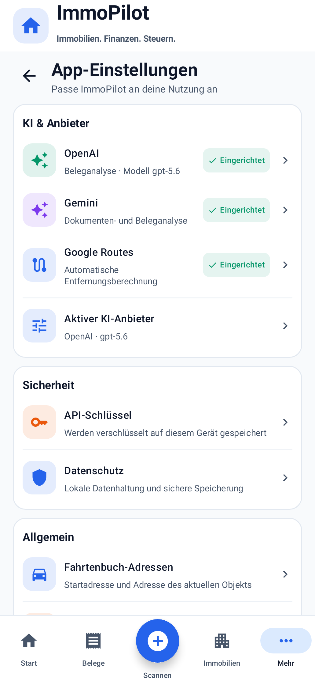
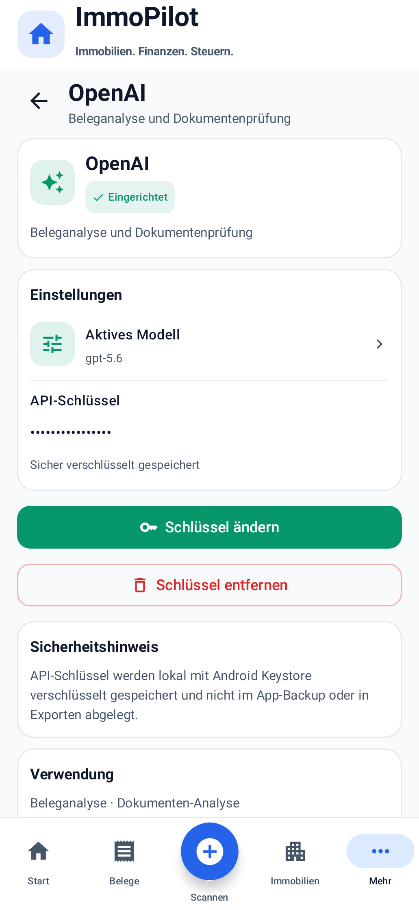
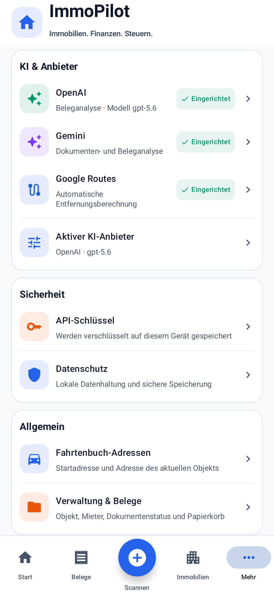
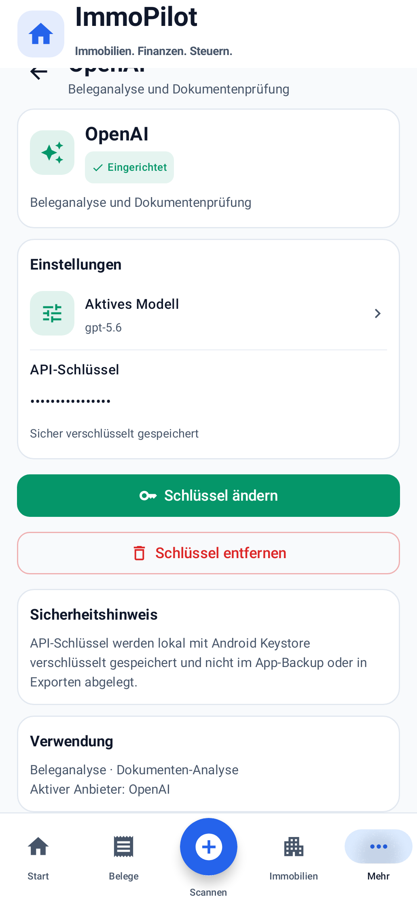

# App-Einstellungen im ImmoPilot-Design

Basis-main: `17f1318723e9bbae6d898af3284d8b341f0223cb` (PR #103).
Branch: `ui/app-settings-immopilot`. Nicht mergen.

## Vorher und nachher

Ein großer `AccountSettingsDialog` mit verschachteltem `AiProviderSettingsDialog` wird durch normale Seiten im bestehenden globalen Scaffold ersetzt. Der Einstieg bleibt Mehr → App-Einstellungen. Kopf, Subtitle und globale Bottom Navigation bleiben unverändert.

Die Übersicht enthält KI & Anbieter, Sicherheit, Allgemein und Info. Die vorhandenen Provider OpenAI, Gemini und Google Routes haben eigene Unterseiten mit tatsächlichem Konfigurationsstatus, maskiertem Schlüssel, Aktionen, Sicherheitshinweis und Verwendung. OpenAI zeigt das gespeicherte Modell und erhält die vorhandene Freitext-Modellkonfiguration. Eine eigene Anbieterauswahl erhält den bestehenden Wechsel zwischen OpenAI und Gemini. Google Routes bleibt unabhängig davon.

Die Seiten verwenden SoftBackground, weiße Karten, bestehende Farben und Ui2-Radien, 16 dp Außenabstand, 10 dp Kartenabstand, 12 dp Innenabstand, 42 dp Iconflächen, farbige/neutralgraue Statuschips und Chevrons. Umfangreiche Inhalte scrollen innerhalb des globalen App-Rahmens.

## Tatsächlich vorhandene Funktionen

| Bisherige Funktion | Neuer Einstieg |
| --- | --- |
| OpenAI-, Gemini-, Routes-Schlüssel | KI & Anbieter → jeweiliger Anbieter |
| OpenAI-Modell | OpenAI → Aktives Modell |
| Anbieterauswahl | KI & Anbieter → Aktiver KI-Anbieter |
| Wohnort-/Objektadresse | Allgemein → Fahrtenbuch-Adressen |
| Mieter verwalten | Allgemein → Verwaltung & Belege |
| Objekt-Stammdaten | Allgemein → Verwaltung & Belege |
| Dokumentenstatus/Reparatur | Allgemein → Verwaltung & Belege |
| Papierkorb | Allgemein → Verwaltung & Belege |
| Lokale Belegdaten zurücksetzen | Allgemein → Verwaltung & Belege, vorhandene Sicherheitsbestätigung |
| Backup/Cloud | Unverändert Mehr → Daten & Sicherung → Backup & Cloud |
| Gelernte Regeln | Unverändert Mehr → KI & Automatisierung → Gelernte Regeln |

Datenschutz und Info sind statische, implementierungsgestützte Hinweise. Benachrichtigungen, Standard-Objekt, Sprache und Darstellung wurden nicht ergänzt: dafür existiert keine entsprechende Einstellungslogik. Die aktuelle Objekt-Auswahl wird nicht als neue Standard-Objekt-Einstellung umgedeutet. Die bisherige starre Steuerjahr-Anzeige „2026“ war keine Einstellung und wird nicht als solche übernommen.

## Schlüssel und Sicherheit

`AiProviderSettings`, `ReceiptViewModel`, Clients, Routenservice, Room, Backup und Restore bleiben unverändert. Die UI liest nur AiProviderState, niemals gespeicherte Klartext-Schlüssel. Alle Änderungen verwenden weiterhin saveAiProviderSettings und die vorhandenen providerbezogenen Löschmethoden. Die bestehenden Formatprüfungen und Android-Keystore-Aliase/AES-GCM bleiben bestehen. Vor einer Schlüsseländerung ist weiterhin die Privatgeräte-Bestätigung erforderlich. Die Schlüsseleingabe verwendet PasswordVisualTransformation und ein Passwort-Tastaturfeld ohne Autokorrektur. Sie wird nicht als Saveable-State gespeichert und beim Verlassen geleert.

Schlüsseländerungen erhalten einen bereits eingerichteten aktiven KI-Anbieter. Beim ersten Einrichten ohne verfügbaren aktiven KI-Schlüssel wird der gerade eingerichtete KI-Anbieter ausgewählt; die UI erklärt dies vor dem Speichern. Die vorhandene Anbieterauswahl erlaubt Wechseln zwischen eingerichteten Anbietern. Routes-Schlüsseländerungen erhalten die KI-Auswahl. Das gespeicherte OpenAI-Modell wird bei Schlüsseländerungen unverändert weitergereicht.

Entfernen erfordert eine Bestätigung und ruft nur die Löschfunktion des betreffenden Providers auf. Das bestehende OpenAI-Löschverhalten setzt die Anbieter-Auswahl auf Gemini zurück; Schlüssel anderer Anbieter und Modell bleiben erhalten. Speicherfehler werden mit den vorhandenen deutschen Fehlertexten angezeigt; Löschfehler erhalten eine neutrale deutsche Meldung ohne Exception-/Schlüsselinhalt.

## Navigation

Android-Zurück und der sichtbare Rückpfeil verwenden denselben Rückweg. Providerseiten kehren zu ihrer tatsächlichen Herkunft zurück (Übersicht oder API-Schlüssel-Übersicht); Schlüssel-/Modellbearbeitung kehrt zum Provider zurück. Übersicht → Mehr. Alle Seiten leben im bestehenden Mehr-Bereich und erzeugen keine zusätzlichen globalen Backstack-Einträge. Die zentrale Navigation aus PR #103 setzt den lokalen Einstellungenzustand bei allen fünf Hauptzielen zurück, einschließlich Mehr-Reselect.

Bestätigungsdialoge und die bestehenden fachlichen Verwaltungsdialoge bleiben normale modale Android-Dialoge. Die Einstellungsübersicht, sämtliche Providerseiten, Schlüssel-/Modellbearbeitung und Informationsseiten sind keine Dialoge.

## Prüfung und Screenshots

Am 05.10.2026 erfolgreich ausgeführt:

```sh
git diff --check
gradle :app:testDebugUnitTest :app:lintDebug :app:assembleDebug \
  -Proborazzi.test.record=true -Pksp.incremental=false
```

- 643 Tests: 0 Fehler, 0 übersprungen. Der Gesamtlauf umfasst Unit-, Compose- und vorhandene Security-/Backup-/Exportprüfungen.
- 9 neue Compose-Tests: reale Statusänderungen aller Provider, maskierte Anzeige, sichere Eingabe/Speicherung und Fehler, bestätigtes isoliertes Entfernen, Modell/Anbieter-Erhalt, Rückwege, keine erfundenen oder doppelten Einträge und 60 physische Bottom-Navigation-Klicks aus 12 Einstellungsseiten.
- 3 neue Security-Tests: Produktions-AES/GCM-Roundtrip für alle Provider, Eingabepuffer-Bereinigung, kein Klartext in Preferences/Status, zufällige IVs, isoliertes Löschen und vorhandene Formatvalidierung.
- Bestehende More-/PrimaryNavigation-Tests auf Seitennavigation angepasst. PrimaryNavigation- und RentOverview-Testfixtures verwenden denselben Application-Kontext wie das ViewModel. Ein testseitiger Rule isoliert den Application-Cache der AndroidViewModelFactory pro Test; alle fachlichen Assertions bleiben erhalten. Beim Aufräumen wird der Dashboard-Flow aktiviert, damit die Emission nach dem Leeren beobachtet wird. Keine Produktionsänderung hierfür.
- Android Lint: 0 Fehler, 97 bestehende Warnungen; keine Meldung zur neuen Einstellungsimplementierung.
- Debug-APK erfolgreich erstellt: 33.705.837 Bytes.
- Gradle 9.3.1, JDK 17, SDK 36.1 / Build Tools 36.0.0; native Robolectric-Test-API 35. Der lokale KSP-Cache wurde nach einem EOF-Cachefehler isoliert; für die Prüfung wurde inkrementelles KSP lokal deaktiviert. Kein Test wurde deaktiviert und keine Build-Konfiguration geändert.

Die Aufnahmen verwenden 393 × 852 dp bei 420 dpi. Die Testprüfung verlangt sichtbare Kopf-/Bottom-Navigation-Pixel; zusätzlich wurden die Aufnahmen visuell geprüft. Übersicht und Providerseite scrollen bei Bedarf.

| Übersicht | OpenAI |
| --- | --- |
|  |  |
|  |  |

## Grenzen

Die Sicherheits-Roundtrip-Tests verwenden reale JVM-AES/GCM-Verschlüsselung mit einem ausschließlich testseitigen In-Memory-AndroidKeyStore-Adapter. Sie prüfen Produktions-Speicherpfade, IV-Wechsel, Formatvalidierung, CharArray-Bereinigung und Provider-Isolation; sie beweisen keine hardwaregestützte Keystore-Eigenschaft auf einem realen Gerät. Compose-Prüfungen und Screenshots sind native Robolectric-Aufnahmen, keine Hardware-Instrumentierung. Es werden keine echten Anbieteranfragen, Drive-Transfers oder DATEV-Exporte ausgeführt.

Die früheren allgemeinen Einstellungen-Muster enthalten fiktive Funktionen, die entsprechend dem aktuellen Auftrag nicht übernommen werden. Die aktuelle Spezifikation und bestehende ImmoPilot-Screens bestimmen die tatsächlichen Inhalte. Eine separate ältere OpenAI-Bildvorlage war nicht abrufbar; die Providerseite folgt der vorgegebenen Struktur.
