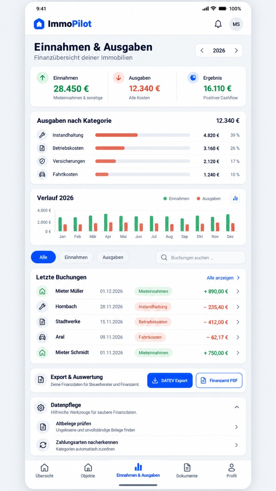
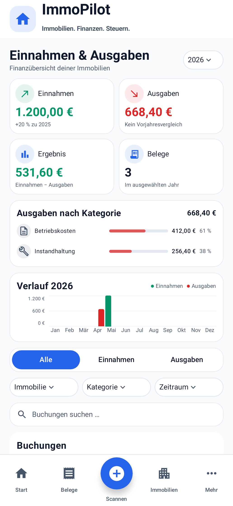

# Einnahmen & Ausgaben – Ledger-Überarbeitung

Basis: `ed40b647ba25879a5a30def913923e49516c9447` (main, nach PR #97).
Branch: `ui/ledger-immopilot`. Kein Merge.

## Umfang und Referenz

Geändert wird ausschließlich der Inhalt von `AppScreen.LEDGER`. Die vorhandene globale Top App Bar und Bottom Navigation bleiben unverändert. In `ReceiptAppUi.kt` ist der Code außerhalb von `LedgerScreen` byte-identisch zur Basis.

Die Darstellung folgt dem Referenzbild mit kompakter Titel-/Jahreszeile, Kategorieauswertung, verdichtetem Jahresverlauf und Buchungen in einer gemeinsamen weißen Listenkarte. Die ausdrücklich verlangten vier Kennzahlen im 2×2-Grid, Immobilien-/Kategorie-/Zeitraumfilter, Suche darunter und standardmäßig eingeklappten Werkzeuge bleiben erhalten. Deshalb ist die Ansicht keine pixelidentische Kopie der Dreier-Kennzahlenkarte im Bild.

| Bereich | Umsetzung |
| --- | --- |
| Titel | 24 sp, graue Unterzeile, weißer dynamischer Jahres-Dropdown |
| Kennzahlen | Weiße kompakte Karten, 16 dp Radius, 32 dp Iconflächen, reale Jahreswerte und belegbarer Vorjahresvergleich |
| Kategorien | Vorhandene Ausgabenkategorien, echte Jahressummen und Anteile; keine neue fachliche Klassifikation |
| Verlauf | Zwölf deutsche Monatslabels, Einnahmen/Ausgaben aus denselben Belegen, echte Nullmonate ohne künstliche Balken |
| Filter | Alle/Einnahmen/Ausgaben, stabile propertyId, tatsächliche Kategorien, Jahr/aktueller Monat/letzter Monat |
| Suche | Lokal nach Aussteller, Beschreibung, Kategorie und effektiver Belegnummer |
| Buchungen | Gemeinsame weiße Listenkarte mit kompakten, weiterhin lazy gerenderten Zeilen; Datum, Kategorie, Immobilie, signierter Betrag und vorhandene Belegdetails |
| Export | Gemeinsame Karte, vorhandene DATEV-Navigation und unveränderter PDF-Jahresdialog |
| Werkzeuge | Eingeklappt; Beschreibung prüfen, sichere Auswahl/Vorschau/Übernahme, Zahlungsarten, SKR03 und Salden bleiben erhalten |
| Abstände | Hauptkarten auf derselben 16-dp-Außenkante; kein doppeltes horizontales Screen-Padding |

## Geänderte Dateien

- `app/src/main/java/com/example/ui/ReceiptAppUi.kt` – ausschließlich `LedgerScreen`.
- `app/src/main/java/com/example/ui/LedgerOverview.kt` – Ledger-Inhalt und vorhandene Design-Tokens.
- `app/src/main/java/com/example/ui/LedgerPresentation.kt` – lesende Jahres-/Filter-/Darstellungsprojektion.
- `app/src/test/java/com/example/ui/LedgerPresentationTest.kt` – zehn Unit-Regressionen.
- `app/src/test/java/com/example/ui/LedgerComposeTest.kt` – sechs Compose-/Screenshot-/Navigationstests einschließlich Größenregressionen und echter Kategorieauswertung.
- `app/src/test/java/com/example/ui/LedgerPdfDocumentShadow.kt` – ausschließlich testseitiger PDF-Plattformadapter.
- `docs/ledger-design/README.md`, unverändertes Referenzbild und 13 gerenderte Vergleichsbilder.

## Erhaltene Fachfunktionen

- Keine Änderungen an Room, Entities, Migrationen, ViewModel-/Repository-Datenhaltung, Backup/Restore, Bank, AfA, Fahrtenbuch oder Steuerberechnungen.
- Einnahmenklassifikation entspricht dem vorhandenen `MonthlyIncomeExpenseChart` und `DatevExporter`: „Miete, Nebenkosten & Kaution“ und „Sonstige Einnahmen“.
- Originalbeträge einschließlich Gutschriften bleiben in den Summen erhalten; negative Monatswerte werden unter der Nulllinie gezeichnet. Vorzeichen in der Anzeige folgen Einnahme/Ausgabe und dem tatsächlichen Betrag.
- Nicht verfügbare Immobilien-IDs und leere Zuordnungen sind im Filter „Nicht zugeordnet“ sichtbar. Gespeicherte IDs werden nicht verändert.
- Kennzahlen und Diagramm beziehen sich auf das ausgewählte Jahr. Die zusätzlichen Filter betreffen die Buchungsliste.
- SKR03-Salden verwenden unverändert alle bisherigen Belege; sie sind keine neue gefilterte Buchhaltung.
- DATEV-/PDF-Exportlogik und technische Belegdetails bleiben vorhanden.

## Prüfungen

- `git diff --check`: bestanden.
- `:app:testDebugUnitTest -Proborazzi.test.record=true`: 584 Tests, 0 Fehler, 0 übersprungen. Darunter 10 neue Unit- und 6 neue Compose-Tests für Ledger.
- `:app:assembleDebug`: bestanden.
- `:app:lintDebug`: bestanden, 0 Fehler / 102 Warnungen. Keine Lint-Meldungen in den neuen Ledger-Dateien.

Ausgeführter gemeinsamer Prüflauf: `gradle :app:testDebugUnitTest :app:lintDebug :app:assembleDebug -Proborazzi.test.record=true --max-workers=2` (Gradle 9.3.1, JDK 17, Android 36.1). Keine Tests oder Prüfungen deaktiviert.

`LedgerPresentationTest` deckt Summen, Klassifizierung, Jahre, ungültige Datumswerte, stabile Immobilien-IDs und nicht verfügbare/alte Zuordnungen, Suche, Kategorie-/Zeitraumkombinationen, Jahreswechsel, Vorzeichen/Gutschriften und echte Vorjahresvergleiche ab.

`LedgerComposeTest` prüft im echten `MainActivity`-Rahmen Kennzahlen, Filter, Suche, Belegdetail-Rückkehr, DATEV-Rückkehr, PDF-Dialog, unveränderten Exportaufruf, Dateiname und PDF-Teilen-Intent, erreichbare Werkzeuge, Android-Zurück zum vorherigen Mehr-Screen, leere Daten, lange Namen und große Beträge. Native Robolectric-/Compose-Screenshots werden für 360×800, 393×852 und 480×960 dp erzeugt.

## Visueller Vergleich

Die Referenz zeigt eine stark verdichtete, lange Gesamtansicht. Die ausdrücklich angeforderten 2×2-Kennzahlen, Zusatzfilter, drei Buchungen und Exporte passen bei lesbarer Typografie nicht vollständig gleichzeitig auf 393×852 dp. Deshalb dokumentieren mehrere Scroll-Screenshots denselben Screen; die bestehende Bottom Navigation bleibt dabei sichtbar.

[Verbindliches Referenzbild](reference.png)

| Referenz | Umsetzung: 393×852 dp |
| --- | --- |
|  |  |

| Größe | Übersicht | Buchungen | Export & Werkzeuge |
| --- | --- | --- | --- |
| 360×800 dp | [Screenshot](360-overview.png) | [Screenshot](360-bookings.png) | [Screenshot](360-exports.png) |
| 393×852 dp | [Screenshot](393-overview.png) | [Screenshot](393-bookings.png) | [Screenshot](393-exports-tools.png) |
| 480×960 dp | [Screenshot](480-overview.png) | [Screenshot](480-bookings.png) | [Screenshot](480-exports.png) |

Zusätzlich geprüft: [ausgeklappte Werkzeuge](393-tools-expanded.png), [Millionenbeträge in Kennzahlen](393-large-amount-metrics.png), [lange Namen und große Buchungsbeträge](393-large-amount-booking.png), [negative Monatswerte/Gutschriften](393-refund-chart.png).

Sichtprüfung: Hauptkarten haben dieselbe linke/rechte Außenkante; weiße Karten, dezente Grenzen, 16-dp-Radius und helle 32-dp-Iconflächen passen zum bestehenden Design. Der Monatsverlauf zeigt alle zwölf Monate; Millionenwerte werden an der Achse lesbar als „Mio. €“ formatiert; Titel und Legende stehen in derselben Zeile. Die Kategorieauswertung verwendet ausschließlich bestehende Ausgabebelege des ausgewählten Jahres. Größenregressionen begrenzen normale Kennzahlen auf 104 dp, den Verlauf auf 120 dp Buchungszeilen auf 80 dp und Filtersegmente auf 40 dp; große Werte dürfen weiter umbrechen. Beträge bleiben vollständig lesbar, lange Ausstellernamen werden ellipsisiert. Drei echte Testbuchungen, Export und eingeklappte Werkzeuge sind in den Scroll-Aufnahmen gemeinsam sichtbar; Kopfbereich und Bottom Navigation werden vom unveränderten App-Scaffold gerendert. Alle Aufnahmen wurden mit nativer Grafik nach vollständiger Neuzeichnung des View-Baums erstellt. Die Tests prüfen zusätzlich die Bildpixel des bestehenden Kopfbereichs und der Bottom Navigation, damit unvollständige native Neuzeichnungen nicht unbemerkt bleiben.

## Grenzen

- Ein lokaler Prüflauf meldete eine NPE in einem KSP/IntelliJ-Hintergrundthread. Die angeforderten Gradle-Tasks und Ledger-Tests wurden dennoch erfolgreich abgeschlossen; die Meldung betrifft das Buildwerkzeug, nicht eine ausgeführte App-Funktion.

- Robolectric mit nativer Grafik statt Hardware-/Emulator-Instrumentierung.
- Kein echter Versand an DATEV/Steuerberater. Robolectric implementiert den nativen `PdfDocument`-Writer nicht (Handle 0, „document is closed!“). Nur die PDF-Plattform wird in diesem UI-Test durch `LedgerPdfDocumentShadow` ersetzt; App-Exporter, Zeichenaufrufe, Dateiname, Dateiablage und Teilen-Intent bleiben echte Aufrufe. Eine reale PDF-Byte-/Geräteprüfung ist damit nicht abgedeckt.
- Keine KI-/Cloud-Nacherkennung im UI-Test ausgelöst. Die bisherigen Funktionen und Auswahl-/Übernahmecallbacks bleiben unverändert.
- Monatsfilter „aktueller/letzter Monat“ bezeichnen den tatsächlichen Kalendermonat. Liegt dieser außerhalb des ausgewählten Jahres, ist die gefilterte Liste entsprechend leer.
