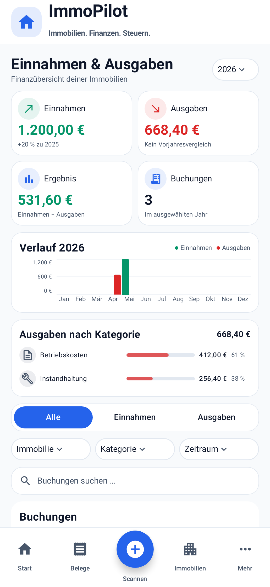
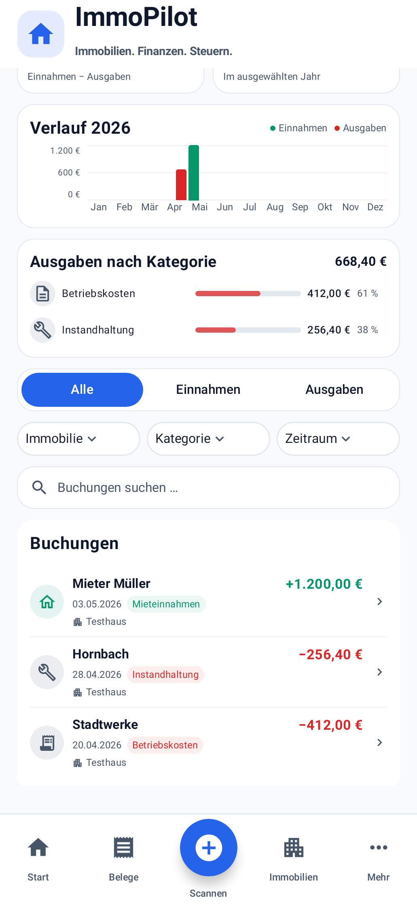

# Einnahmen & Ausgaben – reine Finanzübersicht

Basis-main: `298a761a0c931ea21803931f5a4af13307a282a0` (PR #99).
Branch: `agent/ledger-financial-overview`. Dieser PR wird nicht gemergt.

## Änderung

Ledger enthält nur Titel/Jahr, vier Kennzahlen (Einnahmen, Ausgaben, Ergebnis, Buchungen), Jahresverlauf, Ausgaben nach vorhandenen Kategorien, Filter, lokale Suche und Buchungen. Der Jahresverlauf steht vor der Kategorienübersicht. Die Seite endet nach der Buchungsliste.

Export & Auswertung, DATEV-/PDF-Aktionen, Weitere Werkzeuge, Datenpflege und SKR03 erscheinen nicht mehr im Ledger. Der bestehende App-Scaffold einschließlich ImmoPilot-Kopf und Bottom Navigation ist byte-identisch zur Basis. Navigation, Backstack, Belegdetails und sämtliche Fachberechnungen bleiben unverändert. Keine Migration.

## Erhaltene Funktionen und Einstiege

| Funktion | Einstieg |
| --- | --- |
| DATEV | Mehr → DATEV Export, unveränderter bestehender Export-Assistent |
| PDF-Jahresbericht | Mehr → DATEV Export → PDF-Bericht · Finanzamt |
| Altbelege, Beschreibung nacherkennen | Mehr → DATEV Export → Datenpflege & SKR03 → Altbelege prüfen |
| Vorschau, sichere Vorauswahl, Übernahme | Derselbe vorhandene Datenpflege-Dialog nach Analyse |
| Zahlungsarten nacherkennen | Mehr → DATEV Export → Datenpflege & SKR03 |
| SKR03/Salden | Mehr → DATEV Export → Datenpflege & SKR03 → Saldenaufstellung |

Der PDF-Dialog und die Datenpflege-/SKR03-Inhalte wurden unverändert in `AccountingSupportPanel` verschoben. Der Panel-Aufruf liegt im vorhandenen DATEV-Startbereich, ohne neue Route oder Backstack-Einträge. SKR03-Salden beziehen sich weiterhin auf alle Belege. Kein zweiter Exporter und keine zweite Datenhaltung.

## Dateien

- `ReceiptAppUi.kt`: Ledger auf den lesenden Überblick begrenzen; vorhandene Accounting-Oberflächen im DATEV-Startbereich zugänglich machen.
- `LedgerOverview.kt`: Export/Werkzeuge und zugehörige Parameter entfernen; Reihenfolge und Buchungskennzahl anpassen.
- `LedgerComposeTest.kt`: Ledger-Ende, fehlende Accounting-Aktionen, vorhandene Einstiege unter Mehr, PDF-Aufruf/Teilen, Monatsbalken, Kategorienanteile und Reihenfolge, Kategoriefilter sowie Screenshots anpassen/ergänzen.
- Diese Dokumentation und neue Screenshot-Aufnahmen.

`LedgerPresentation.kt`, Datenmodelle, Room, ViewModel, Bank-/DATEV-/PDF-/Steuerlogik, Backup/Restore und Fahrtenbuch bleiben unverändert. Die bestehenden zehn Unit-Regressionen werden weiterhin ausgeführt.

## Prüfung und Screenshots

Aktueller Prüflauf: `git diff --check` erfolgreich; 585 Tests, 0 Fehler, 0 Fehlschläge, 0 übersprungene Tests. Darunter sieben Ledger-Compose-/Screenshot-Tests und zehn unveränderte Ledger-Unit-Regressionen. Debug-APK erfolgreich erstellt. Android Lint erfolgreich: 0 Fehler, 101 Warnungen im bestehenden Gesamtprojekt; keine Ledger-Funde.

```sh
gradle :app:testDebugUnitTest :app:lintDebug :app:assembleDebug \
  -Proborazzi.test.record=true --max-workers=2 --no-daemon
```

Die neue Regression prüft die vorhandene DATEV-Navigation über Mehr, den PDF-Dialog und den bestehenden Export-/Teilen-Aufruf sowie erreichbare Altbeleg-/Zahlungsarten- und SKR03-Aktionen. Ledger-Tests prüfen explizit das Fehlen aller Accounting-Aktionen, Reihenfolge Verlauf/Kategorien, realen Monatsbalken-Anteil und Nullmonat, Kategorieanteile und Kategoriefilter. Bestehende Tests für Jahre, Summen, Vorzeichen, stabile Immobilien-IDs, Suche, Belegdetails, Empty State, Zurück und sichtbare Navigation bleiben aktiv.

| Größe | Übersicht | Buchungen | Seitenende ohne Werkzeuge |
| --- | --- | --- | --- |
| 360×800 dp | [Bild](360-overview.png) | [Bild](360-bookings.png) | [Bild](360-end.png) |
| 393×852 dp | [Bild](393-overview.png) | [Bild](393-bookings.png) | [Bild](393-end.png) |
| 480×960 dp | [Bild](480-overview.png) | [Bild](480-bookings.png) | [Bild](480-end.png) |





Weitere geprüfte Fälle: [große Kennzahlen](393-large-amount-metrics.png), [lange Namen/Millionenbeträge](393-large-amount-booking.png), [Gutschrift unter der Nulllinie](393-refund-chart.png).

Visuell geprüft: identische Kartenkanten mit 16 dp Außenabstand, vorhandene Farben/Radien/Iconflächen, kompakte Filter und Buchungszeilen, alle zwölf Monatslabels, korrekt signierte Beträge, kein horizontaler Überlauf. Bei 393×852 dp zeigt die Scroll-Aufnahme drei Buchungen; danach endet der Inhalt. ImmoPilot-Kopf und Bottom Navigation bleiben in allen Aufnahmen sichtbar. Bildpixel-Prüfungen sichern beide globalen Bereiche zusätzlich ab. Der Screenshot-Helfer fordert eine vollständige Neuzeichnung sowohl der Android-Views als auch der Compose-Zeichenebenen an; eine zusätzliche Geometrie-Regression prüft getrennte Filtertexte nach dem Scrollen. Bei den kurzen Testlisten sind Buchungs- und Ende-Aufnahmen auf 360/393 dp identisch, weil schon beim Anzeigen der ersten Buchung der untere Scrollanschlag erreicht wird.

Alte Bilder aus `../ledger-design` dokumentieren den vorherigen Stand und sind keine Nachweise dieser Änderung.

Referenz: [erstes Bild](../ledger-design/reference.png). Die aktuelle Anforderung weicht ausdrücklich ab: 2×2 Kennzahlen, Jahresverlauf vor Kategorien, Zusatzfilter und keinerlei Export-/Werkzeugbereich. Für 393×852 dp dokumentieren mehrere Scroll-Aufnahmen denselben Screen mit sichtbarer globaler Navigation; sämtliche Inhalte zugleich würden eine unlesbare Verdichtung erfordern.

## Grenzen

Native Robolectric-Grafik statt Hardware-/Emulator-Instrumentierung. Der bestehende testseitige PDF-Plattformadapter prüft App-Exporter, Aufrufe, Dateiablage und Teilen-Intent; eine echte PDF-Byte-Prüfung auf einem Gerät ist nicht enthalten. KI-Nacherkennung wird im UI-Test nicht ausgelöst; bestehende Vorschau-, Auswahl- und Übernahmecallbacks bleiben erhalten. Monatsfilter beziehen sich auf den tatsächlichen aktuellen/letzten Kalendermonat innerhalb des gewählten Jahres.

Ausgabenkategorien bleiben auf unveränderten Originalbeträgen einschließlich Gutschriften aggregiert. Bei negativen Kategoriebeiträgen kann ein positiver Anteil am Nettoausgabenbetrag über 100 % liegen; die Beträge werden nicht künstlich positiv gemacht.
