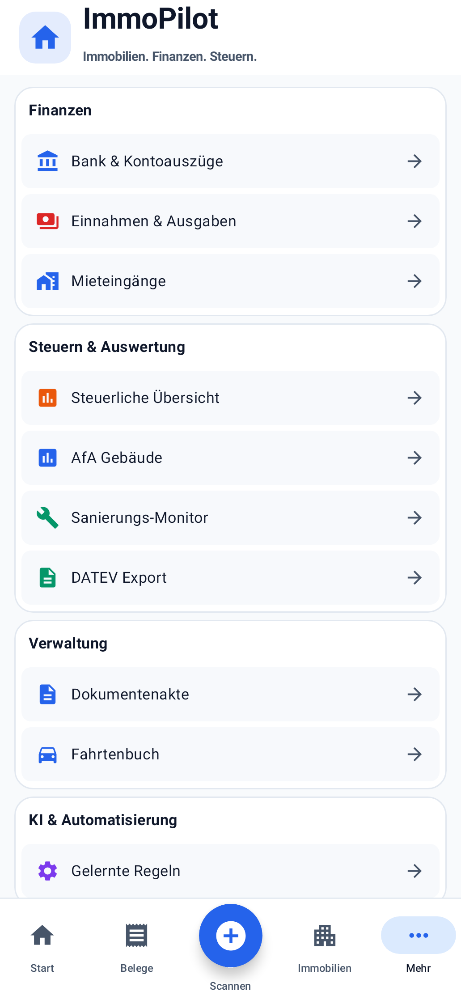
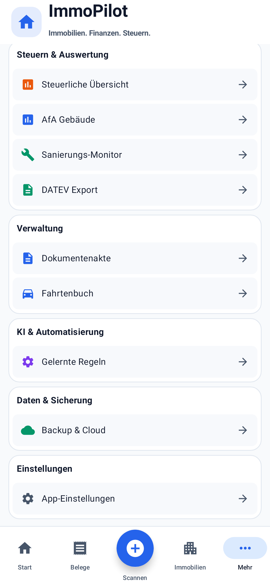

# Mehr-Menü logisch neu strukturieren

Basis-main: `d880ea54b03a3a658cdcadd1ad1755c2af7349bc` (gemergter PR #100).
Branch: `agent/more-menu-structure`. Kein Merge vorgesehen.

## Umfang

Ausschließlich die Menüstruktur von `MoreScreen` und Test-Tags seiner privaten Menükomponenten wurden angepasst. Bestehende weiße Gruppenkarten, 12-dp-Außenabstand, Radien, 46-dp-Mindestzeilenhöhe, 20-dp-Material-Icons, Pfeile, Farben und Typografie bleiben erhalten. Kein neuer Navigationspfad, keine Fachlogikänderung und keine Migration.

Die bisherigen Gruppen **Finanzen → Verwaltung → Objekte & Steuern → Einstellungen** werden durch **Finanzen → Steuern & Auswertung → Verwaltung → KI & Automatisierung → Daten & Sicherung → Einstellungen** ersetzt.

| Neue Gruppe | Eintrag | Bestehendes Ziel | Material-Icon / Farbe |
| --- | --- | --- | --- |
| Finanzen | Bank & Kontoauszüge | BANK | AccountBalance / AccentBlue |
| Finanzen | Einnahmen & Ausgaben | LEDGER | Payments / CrimsonRed |
| Finanzen | Mieteingänge | RENT_OVERVIEW | HomeWork / AccentBlue |
| Steuern & Auswertung | Steuerliche Übersicht | TAX_CALCULATOR | Assessment / WarmOrange |
| Steuern & Auswertung | AfA Gebäude | AfaPortfolioScreen | Assessment / AccentBlue |
| Steuern & Auswertung | Sanierungs-Monitor | PropertyTaxUi2Screen(monitor = true) | Build / EmeraldGreen |
| Steuern & Auswertung | DATEV Export | openDatevExport() | Description / EmeraldGreen |
| Verwaltung | Dokumentenakte | DOCUMENTS | Description / AccentBlue |
| Verwaltung | Fahrtenbuch | LOGBOOK | DirectionsCar / AccentBlue |
| KI & Automatisierung | Gelernte Regeln | page = "rules" | Settings / Violett #7C3AED |
| Daten & Sicherung | Backup & Cloud | page = "backup" | Cloud / EmeraldGreen |
| Einstellungen | App-Einstellungen | bestehender AccountSettingsDialog | Settings / SlateGray |

Umbenannt: „Bank / Kontoauszüge“, „Einnahmen / Ausgaben“, „Regeln“ und „App Einstellungen“. Das Backup-Icon wechselt fachlich passend von Description zu Cloud; seine grüne Farbe bleibt erhalten. Alle anderen Material-Icons und Iconfarben bleiben unverändert.

Einzige entfernte Doppelung: **Immobilien verwalten** in Mehr. Der bestehende feste Bottom-Navigationseintrag **Immobilien** und der gesamte Immobilienbereich bleiben unverändert.

## Erhaltene Unterseiten

AfA, Sanierungs-Monitor, Regeln (einschließlich Gelerntem KI-Wissen/Händler-Zuordnungen/BankRulesPanel), Backup (GoogleDriveSyncCard) und Einstellungen verwenden exakt dieselben bestehenden Funktionen und Callbacks. Android-Zurück sowie sichtbare Zurück-Aktionen werden geprüft. Die AfA-eigene Unterseiten-Navigation bleibt ebenfalls unverändert.

## Dateien

- `app/src/main/java/com/example/ui/ImmobilienManagerFeature.kt`: Cloud-Import, Menügruppen/-bezeichnungen, Doppelung entfernen und Test-Tags ausschließlich für Mehr.
- `app/src/test/java/com/example/ui/MoreMenuComposeTest.kt`: fünf Compose-/Screenshot-/Navigationstests im echten App-Scaffold.
- `app/src/test/java/com/example/ui/LedgerComposeTest.kt`: vorhandenen Test an die neue Menübezeichnung „Einnahmen & Ausgaben“ anpassen.
- Diese Dokumentation und aktuelle Screenshot-Aufnahmen.

`ReceiptAppUi.kt` mit globalem ImmoPilot-Kopf und Bottom Navigation, ViewModel, Datenmodelle, Room, DATEV, Bank, Backup/Restore, Steuerlogik und Fahrtenbuch werden nicht verändert. Der Code außerhalb von MoreScreen und seinen privaten Menühelfern in ImmobilienManagerFeature bleibt bis auf den benötigten Cloud-Import byte-identisch.

## Prüfung

Abschließender Prüflauf am 03.10.2026:

- `git diff --check`: bestanden.
- `:app:testDebugUnitTest`: **590 Tests bestanden**, 0 Fehler, 0 übersprungen; darunter alle fünf neuen Mehr-Tests und bestehende Navigations-/Ledger-Regressionstests.
- `:app:lintDebug`: bestanden, **0 Fehler / 98 Warnungen** im Projekt.
- `:app:assembleDebug`: bestanden; Debug-APK erstellt (36.578.072 Byte).
- Gemeinsamer Gradle-Prüflauf: `BUILD SUCCESSFUL`.
- Visuelle Prüfung bei **393 × 852 dp**: gleiche Kartenkanten, farbige Icons, lesbare Bezeichnungen, Einstellungen zuletzt, unveränderter ImmoPilot-Kopf und sichtbare Bottom Navigation. Alle zwölf Iconfarben zusätzlich an den tatsächlichen Screenshot-Pixeln geprüft.

| Oberer Bereich | Bis zu Einstellungen gescrollt |
| --- | --- |
|  |  |

Die neuen UI-Tests prüfen Gruppenreihenfolge und Mitgliedschaft, identische Kartenkanten, fehlenden Immobilien-Doppeleinstieg, sämtliche zwölf Ziele, bestehende Immobilien-Bottom-Navigation, Einstellungen-Dialog, Android-/sichtbare Zurück-Aktionen für alle vier internen Unterseiten und unveränderten Haupt-Backstack. Native Screenshots für 393×852 dp prüfen zusätzlich die tatsächlichen farbigen Icon-Pixel. Die Aufnahmen zeichnen Android-Views und Compose-Zeichenebenen vollständig neu.

## Grenzen

Native Robolectric-Grafik statt Hardware-/Emulator-Instrumentierung. Beim bestehenden Einstellungsdialog prüft der Test das tatsächlich geöffnete Android-Dialogfenster und dessen Zurück-Dispatcher direkt, um die native Robolectric-Material-Dialog-Messschleife zu vermeiden. Kein echter Google-Login, Cloud-Upload, Restore, DATEV-Versand oder KI-Lauf im UI-Test ausgelöst. Die vorhandenen Fachfunktionen und ihre Implementierungen bleiben unverändert. Alle sechs Gruppen benötigen auf 393×852 dp Scrollen; zwei Aufnahmen dokumentieren denselben Screen mit sichtbarem Kopf und Bottom Navigation.
