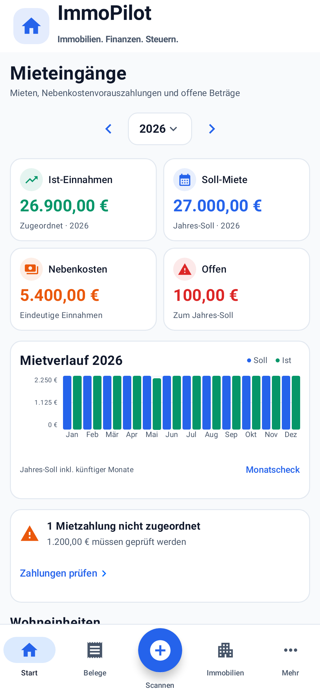
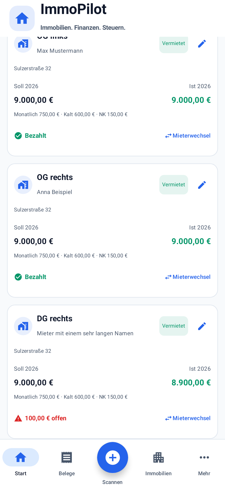
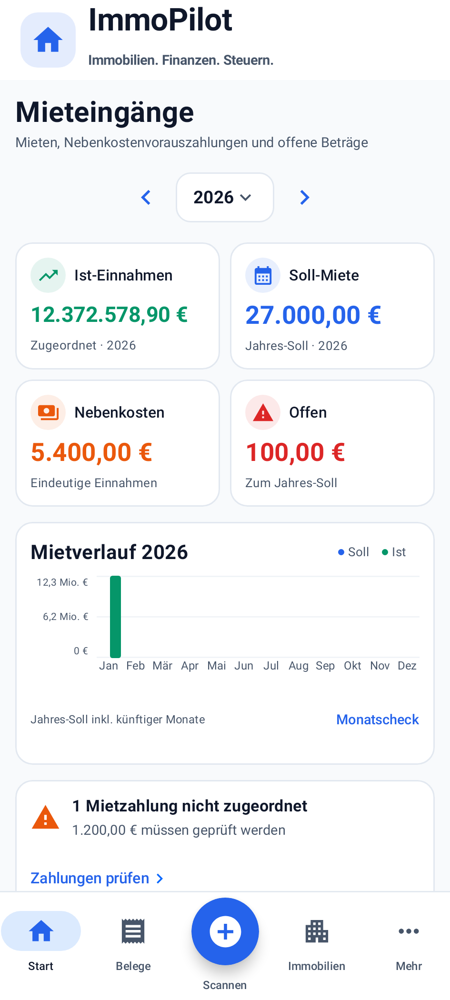

# Mieteingänge als Mietkontroll-Übersicht

Basis-main: `35256ef21a69049c5dcdabe7df5af0a6b527aede`.
Branch: `agent/rent-control-overview`. Noch nicht mergen.

## Oberfläche

Vorher: „Mieteinnahmen & Nebenkosten“, Steuerjahr, eine textlastige Jahresübersicht, technische Ist-Aufteilungen auf jeder Einheit und überlagernde Monatscheck-/Mieterwechsel-FABs.

Jetzt: „Mieteingänge“ → dynamisches Mietjahr → 2×2 Kennzahlen (Ist-Einnahmen, Soll-Miete, Nebenkosten, Offen) → zwölfmonatiger Soll-/Ist-Verlauf → bedingte Warnkarte für unzugeordnete Zahlungen → kompakte Wohneinheiten mit Jahres-Soll, Jahres-Ist und Bezahlt/Offen/Kein Soll.

Monatscheck bleibt als kompakte Aktion in der Verlaufskarte erreichbar. Mieterwechsel/Mieterhistorie und der bestehende Mietplan-Dialog sind direkt an jeder Einheit erreichbar. Ist-Aufteilungen bleiben im Mietplan-Dialog erhalten. Es gibt keine Export-, Steuer-, DATEV-, AfA- oder Nebenkostenabrechnungsbereiche auf dieser Seite.

Die bestehenden ImmoPilot-Farben, Material-Icons, weißen Karten, 14-dp-Radien und 12-dp-Außenabstände werden verwendet. Keine Änderungen an globalem Kopf, Bottom Navigation, Bankliste, Ledger, DATEV, Dokumenten oder globaler Immobiliennavigation. Der vorhandene PropertySection.RENT erhält lediglich seinen fehlenden Einstieg „Mieteingänge“ in der aktuellen Immobilien-Detailkarte; Ziel und Backstack bleiben bestehend.

## Berechnung und Zuordnung

- Daten bleiben die bestehenden Receipt-/Immobilien-/Wohneinheiten-Flows, Scoped-Rent-Prefs und TenantHistoryStore; keine zweite Datenhaltung.
- Soll und Monatsverlauf verwenden **RentTrackingLogic.year/month**. Bestehende Mietperioden berücksichtigen Beginn, Ende, Mieterwechsel und anteilige Tage; ohne Historie bleibt der vorhandene Vertrags-Fallback erhalten. Leerstand ohne Mietperiode erzeugt kein Soll. Historische beendete Mietperioden bleiben im jeweiligen Jahr berücksichtigt.
- Jahres-Ist entspricht der Summe zugeordneter Mietbelege nach unverändertem **isRentalIncomeReceipt**. Kaution, Einzahlung Kaution und Rückzahlung Kaution bleiben ausgeschlossen.
- Offen = Summe der **max(0, Jahres-Soll − Jahres-Ist)** pro Einheit. Mehrzahlungen einer anderen Einheit verdecken keine Rückstände. Jahreswerte sind ausdrücklich gekennzeichnet; der Hinweis „Jahres-Soll inkl. künftiger Monate“ verhindert die Verwechslung mit bereits fälligen Rückständen. Der vorhandene Monatscheck bleibt für einzelne Monatsstatus verfügbar.
- Nebenkosten zählen nur zugeordnete Einnahmen mit expliziter Nebenkosten-/Betriebskosten-Unterkategorie (z. B. Voraus-/Nachzahlung). Betriebskosten-Ausgaben werden nicht einbezogen. Warm-/Pauschalmieten werden mangels verlässlicher Belegaufteilung nicht geschätzt oder künstlich zerlegt. Die Nebenkostenkennzahl ist ein Teilbetrag der Ist-Einnahmen, kein zusätzliches Einkommen.
- Global werden die vorhandenen Immobilien und ihre Einheiten zusammengeführt; propertyScoped zeigt nur die ausgewählte Immobilie. Receipt besitzt keine Unit-ID: Belegzuordnung verwendet deshalb weiterhin den gespeicherten Einheitennamen **innerhalb der stabilen propertyId**. Listen, Mietpläne und Historie verwenden die bestehende stabile Unit-ID. Keine Room-Migration.
- Unzugeordnet bedeutet: keine passende Kombination aus propertyId und gespeichertem Einheitennamen, auch bei unbekannter/fehlender Immobilie. Warnung zeigt Anzahl und Betrag. „Zahlungen prüfen“ öffnet die bestehende Belegliste für das ausgewählte Jahr, ohne neue Buchungslogik oder neue Belegansicht; sie zeigt auch weitere Belege des Jahres.

## Erhaltene Bearbeitung

Der bestehende Dialog speichert Kaltmiete, NK-Vorauszahlung, sonstige Mietbestandteile und Mietbeginn über dieselben vorhandenen Speicherfunktionen. Die richtige Immobilie wird vor dem bestehenden updateWohneinheit aktiviert; anschließend wird die ursprüngliche Auswahl wiederhergestellt. Ein vorhandener aktueller Historienvertrag wird konsistent aktualisiert, beendete Historienverträge bleiben unverändert.

Der alte Parser entfernte jeden Punkt, sodass z. B. `750.0` zu `7500` wurde. Neuer Eingabeparser akzeptiert Dezimalpunkt, Dezimalkomma und deutsche Tausenderpunkte mit Dezimalkomma. Leere Beträge gelten als 0. Negative, ungültige, NaN-/Infinity- und nicht im vorhandenen Float-Speicher darstellbare Beträge werden abgelehnt. Mietbeginn wird als echtes ISO-Datum geprüft; leer bleibt nur ohne vorherigen beendeten Vertrag zulässig. Ein Mietbeginn darf nicht in eine beendete Vorgängerperiode zurückreichen.

## Notwendige gemeinsame Korrekturen

- RentTrackingLogic ergänzt die propertyId bei der bestehenden Receipt-Zuordnung. Keine Änderung an Bankzuweisung, Konten, DATEV oder der Sollformel.
- Die aktuelle Immobilien-Detailkarte verlinkt den vorhandenen PropertySection.RENT wieder. Der ältere, nicht mehr verwendete PropertyDashboard enthielt diesen Einstieg bereits; es wird keine neue Route angelegt.
- getWohneinheitenForProperty übergibt für das Legacy-Objekt dessen tatsächliche propertyId an den vorhandenen Getter, statt bei globaler Anzeige den Namespace einer anderen aktuell ausgewählten Immobilie zu verwenden. Bestehende IDs, Werte und Aufrufer bleiben kompatibel.

## Dateien

- `RentIncomeFeature.kt`: Übersicht, Chart, Karten, Warnung, vorhandener Mietplan-Dialog.
- `RentTenantWrapper.kt`: bestehender Monatscheck und Mieterhistorie ohne überlagernde FABs, Property-Scope erhalten.
- `RentOverviewPresentation.kt`: lesende Aggregation aus vorhandener Mietprojektion und validierte Mietplan-Eingaben.
- `PropertyUnitScopedData.kt`: zusätzliche propertyId-Bedingung bei Mietbelegzuordnung.
- `ImmobilienManagerFeature.kt`: ein bestehender Mieteingänge-Einstieg zur immobilienbezogenen Mietkontrolle.
- `ReceiptViewModel.kt`: expliziter Property-Namespace im Legacy-Unit-Getter.
- `RentOverviewPresentationTest.kt`: Aggregations-, Klassifikations-, Mietperioden-, Scope- und Validierungstests.
- `RentOverviewComposeTest.kt`: echter App-Scaffold, Navigation, Mietplan-Speicherung, Scope, Empty State, vorhandene Unterfunktionen und native Screenshots.
- Diese Dokumentation und aktuelle Screenshot-Dateien.

## Prüfung

Abschließender Prüflauf am 04.10.2026:

- `git diff --check`: bestanden.
- `:app:testDebugUnitTest`: **612 Tests bestanden**, 0 Fehler, 0 übersprungen; darunter 13 neue fachliche Regressionstests und 9 neue Compose-/Screenshot-Tests.
- `:app:lintDebug`: bestanden, **0 Fehler / 99 Warnungen** im Projekt.
- `:app:assembleDebug`: bestanden; Debug-APK erstellt (33.705.837 Byte).
- Gemeinsamer Gradle-Prüflauf: `BUILD SUCCESSFUL` (9m 42s).
- Visuelle Prüfung: **393 × 852 dp** für Übersicht und Wohneinheiten; **360 × 800 dp** mit sehr großem Betrag. Einheitliche Kartenkanten, klare Zahlungsstatus, ellipsierte lange Namen, lesbare zwölf Monate, unveränderter Kopf und sichtbare Bottom Navigation. Diagramm-Balkenhöhen werden für einen tatsächlichen Soll-/Ist-Unterschied zusätzlich geprüft. Millionenbeträge werden auf der Diagrammachse kompakt formatiert.
- Mietplan-Eingaben und tatsächliches Speichern inklusive aktiver Historie geprüft; zwei gleich benannte Einheiten in verschiedenen Immobilien bleiben getrennt. Monatscheck, Mieterhistorie, Belegprüfung und Android-Zurück aus Mehr bzw. Immobilienansicht werden ausgeführt.
- Kein Test deaktiviert.

| Übersicht, 393 × 852 dp | Wohneinheiten, gescrollt |
| --- | --- |
|  |  |

## Grenzen

Native Robolectric-Grafik statt Hardware-/Emulator-Instrumentierung. Für Eingaben im echten Mietplan-Dialog setzt der UI-Test ausschließlich die Android-Fenstergröße auf feste Gerätemaße, um die native Robolectric-Wrap-Content-Messschleife zu vermeiden. Produktionsdialog und Speicherpfad bleiben davon unberührt. Testdatenbank und Miet-Prefs werden pro Test isoliert zurückgesetzt. Kein echter Bankimport, Drive-Upload/Restore oder DATEV-Versand ausgelöst. Die fachlichen Implementierungen dieser Bereiche bleiben unverändert. Bei 393×852 dp erfordern Übersicht und drei vollständige Einheitenkarten Scrollen; mehrere Aufnahmen zeigen denselben Screen mit sichtbarem globalem Kopf und Bottom Navigation. Keine künstliche Verkleinerung, um den gesamten Scrollinhalt in ein Display zu quetschen.
